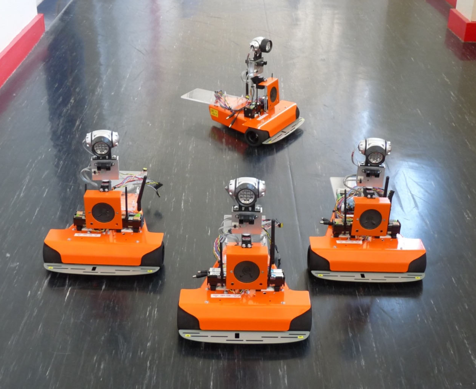
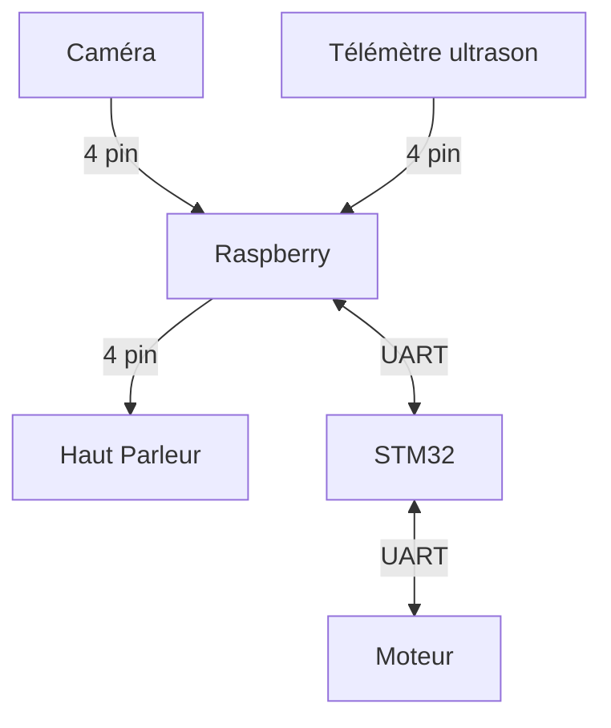

# Rapport Pré Etude équipe C4

#### Membres du groupe : 
- Joseph POURADIER DUTEIL
- Adrien DALBEIGUE
- Rachid EMZIANE
- Pierre-Louis TELEP
- Maxime GIROUD
- Shézan MAHAMODRAZA

## Sommaire
- [Rapport Pré Etude équipe C4](#rapport-pré-etude-équipe-c4)
      - [Membres du groupe :](#membres-du-groupe-)
  - [Sommaire](#sommaire)
  - [Introduction](#introduction)
  - [Fonctionalités](#fonctionalités)
  - [Schéma de fonctionnement](#schéma-de-fonctionnement)
  - [Réalisation jusqu'à ce jour](#réalisation-jusquà-ce-jour)
  - [Objectifs pour le Jalon 1](#objectifs-pour-le-jalon-1)

## Introduction

En ces temps émotionnellement  difficile pour la population, nous voulons faire un robot de support émotionnel qui détecte les personnes, se déplace vers elles et leur dit des mots gentils.  Il y aura un mode automatique où le robot se déplace seul comme décris au-dessus. Il y aura un mode manuelle, où l'utilisateur déplace le robot depuis une interface web.

## Fonctionalités

<u>Pour le mode automatique</u>:  
Notre robot pourra détecter  les obstacles grâce à une télémètrie ultrason, pour les esquiver ou les contourner. Il pourra détecter les personnes pour aller vers elles grâce a une caméra et la détection de visage. Une fois proche des personnes, on utilisera le haut parleur pour parler.

<u>Pour le mode manuel</u>:  
Le robot sera contrôlé par un ordinateur qui se connectera à une réseau local (un partage de connexion avec un téléphone par exemple). Le serveur web sera sur le raspberry PI en python. Le déplacement se fera grâce aux fleches directionnelle du clavier. Et on pourra parler en live grâce au micro de l'ordinateur. 

## Schéma de fonctionnement

## Réalisation jusqu'à ce jour

Pour tout le codes nous avons choisi de travailler en python pour ça faciliter de développement et parce que dans notre cas nous pouvons tous faire avec python, du serveur web a la reconnaissance d'image et l'utilisation des GPIO du raspberry. De plus nous allons utiliser des librairies python tel que openCV pour la détection de visage et la reconnaissance de parole, or ces librairies sont en fait des librairies en C ou en C++ donc on bénéficie tout de même de la puissance du C. Et python est cross plateforme donc on peut utiliser le même code sur le raspberry et sur nos ordinateurs.  

Pour l'instant nous avons un site local qui permet de visualiser le retour de la caméra de l'ordinateur. Sur le flux vidéo on peut voir le nombre de visages détectés et un carré bleu pour chaque visage. Nous avons des fonctions pour transformer du texte en parole et des paroles en texte mais ces fonctions sont pour l'instant bien trop lentes pour être utilisées en temps réel, nous avons un délai de 7s pour charger une phrase. Pour ce qui est de l'os du rapsberry nous avons choisi Ubuntu sans interface desktop pour bénéficier d'un maximum de performance. Il nous reste plus qu'à installer les différentes librairies et notre code python pour mettre en place le serveur. 

## Objectifs pour le Jalon 1

date : 18/04 
- mise en place du serveur web sur le raspberry avec connexion possible depuis un ordinateur ou un téléphone, le réseau local sera créé avec un partage de connexion via un téléphone.
- sur ce site web il y aura le retour de la caméra du raspberry avec la détection des visages et le son.
- on pourra contrôler les roues du robot avec le stm32 via une connexion UART.
- on pourra emmètre du son du client vers le haut-parleur du robot

## Répartitions des taches techniques

- Pierre-Louis TELEP : serveur web avec Flask, front et back-end, mise en place de l'os sur le raspberry.
- Rachid EMZIANE : mise en place de l'os, du réseau local, installation des librairies et du code python pour le serveur web.
- Shézane MAHAMODRAZA : détection des visages avec openCV, reconnaissance de parole avec google speech API.
- Adrien DALBEIGUE : text to speech, enregistrement du son et streaming du son vers le site web.
- Maxime GIROUD : moteur, télémètre ultrason, stm32, UART.
- Joseph POURADIER DUTEIL : moteur, télémètre ultrason, stm32, UART.

