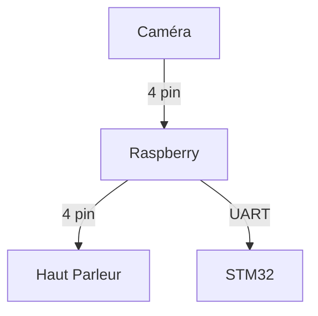

# Rapport Pré Etude équipe C4

#### Membres du groupe : 
- Joseph POURADIER DUTEIL
- Adrien DALBEIGUE
- Rachid EMZIANE
- Pierre-Louis TELEP
- Maxime GIROUD
- Shézan MAHAMODRAZA

## Sommaire
1. [Introduction](#introduction)
2. [Fonctionalités](#fonctionalités)

## Introduction

En ces temps émotionnellement  difficile pour la population, nous voulons faire un robot de support émotionnel qui détecte les personnes, se déplace vers elles et leur dit des mots gentils.  Il y aura un mode automatique où le robot se déplace seul comme décris au-dessus. Il y aura un mode manuelle, où l'utilisateur déplace le robot depuis une interface web.

## Fonctionalités

<u>Pour le mode automatique</u>:  
Notre robot pourra détecter  les obstacles grâce à une télémètre ultrason, pour les esquiver ou les contourner. Il pourra détecter les personnes pour aller vers elles grâce a une caméra et la détection de visage. Une fois proche des personnes, on utilisera le haut parleur pour parler.

<u>Pour le mode manuel</u>:  
Le robot sera contrôlé par un ordinateur qui se connectera à une réseau local (un partage de connexion avec un téléphone par exemple). Le serveur web sera sur le raspberry PI en python. Le déplacement se fera grâce aux fleches directionnelle du clavier. Et on pourra parler en live grâce au micro de l'ordinateur. 

## Schéma de fonctionnement

    
    D-- UART -->C[Robot(moteur)]

## Objectifs pour le Jalon 1

date : 18/04 
- web server sur raspberry pi avec connexion possible avec un ordinateur.
- site web avec détection des visages.
- pouvoir contrôler les roues du robot avec des instructions en durs.
- emmètre du sons a partir du robot.

