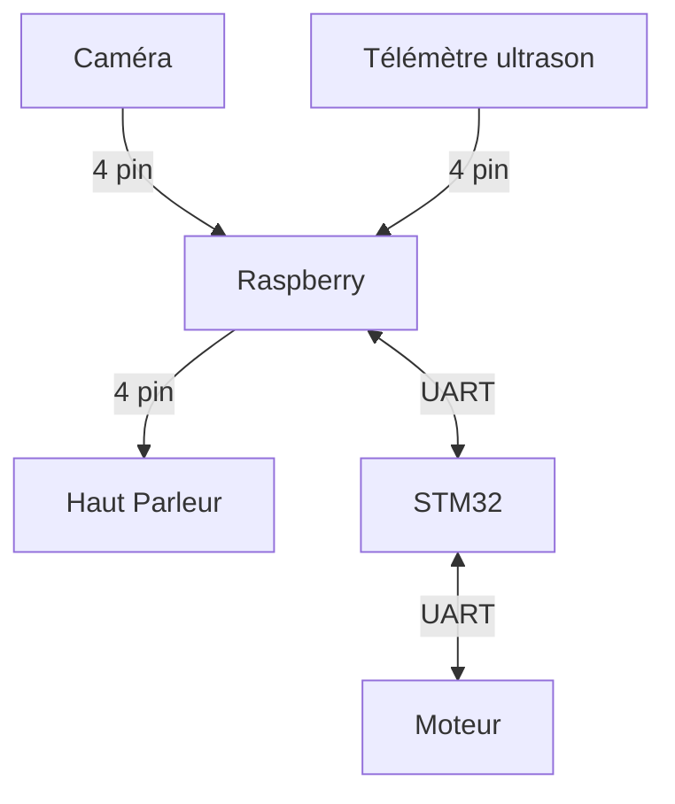
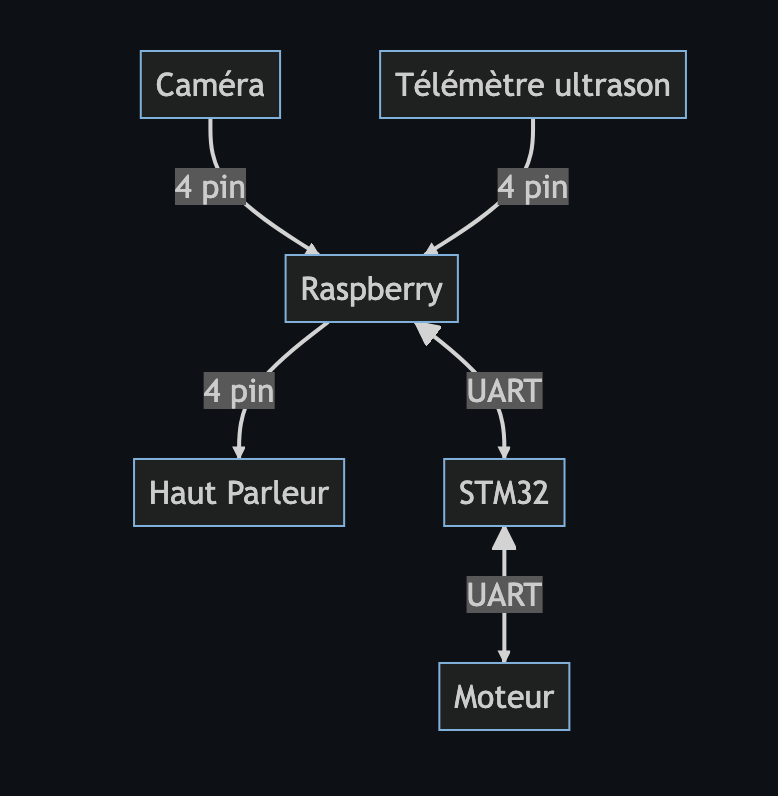

# Rapport Pré Etude équipe C4

#### Membres du groupe : 
- Joseph POURADIER DUTEIL
- Adrien DALBEIGUE
- Rachid EMZIANE
- Pierre-Louis TELEP
- Maxime GIROUD
- Shézan MAHAMODRAZA

## Sommaire
- [Rapport Pré Etude équipe C4](#rapport-pré-etude-équipe-c4)
      - [Membres du groupe :](#membres-du-groupe-)
  - [Sommaire](#sommaire)
  - [Introduction](#introduction)
  - [Fonctionalités](#fonctionalités)
  - [Schéma de fonctionnement](#schéma-de-fonctionnement)
  - [Objectifs pour le Jalon 1](#objectifs-pour-le-jalon-1)

## Introduction

En ces temps émotionnellement  difficile pour la population, nous voulons faire un robot de support émotionnel qui détecte les personnes, se déplace vers elles et leur dit des mots gentils.  Il y aura un mode automatique où le robot se déplace seul comme décris au-dessus. Il y aura un mode manuelle, où l'utilisateur déplace le robot depuis une interface web.

## Fonctionalités

<u>Pour le mode automatique</u>:  
Notre robot pourra détecter  les obstacles grâce à une télémètrie ultrason, pour les esquiver ou les contourner. Il pourra détecter les personnes pour aller vers elles grâce a une caméra et la détection de visage. Une fois proche des personnes, on utilisera le haut parleur pour parler.

<u>Pour le mode manuel</u>:  
Le robot sera contrôlé par un ordinateur qui se connectera à une réseau local (un partage de connexion avec un téléphone par exemple). Le serveur web sera sur le raspberry PI en python. Le déplacement se fera grâce aux fleches directionnelle du clavier. Et on pourra parler en live grâce au micro de l'ordinateur. 

## Schéma de fonctionnement

## 

## Objectifs pour le Jalon 1

date : 18/04 
- mise en place d'un serveur web sur raspberry pi avec connexion possible depuis un ordinateur ou un téléphone.
- sur ce site web il y aura le retour de la caméras du raspberry avec la détection des visages avec le son.
- on pourra controller les roues du robots avec le stm32 via une connexion UART.
- on pourra emmetre du son du client vers le haut parleur du robot

